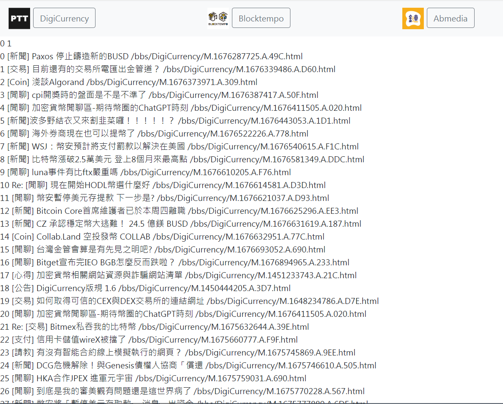
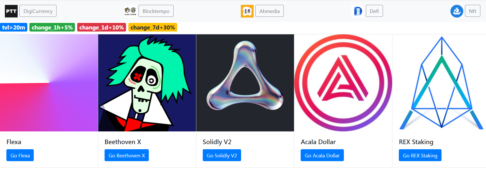
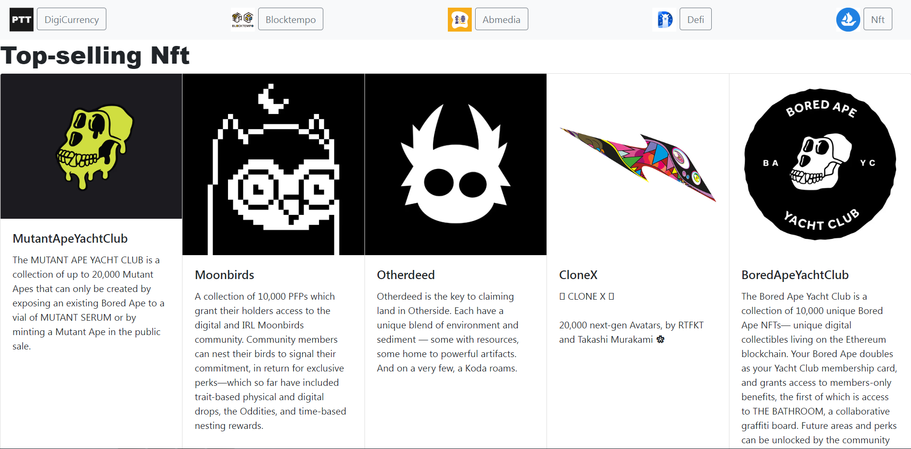

# Crypto-crawler
# 使用`BeautifulSoup`爬取
* [Ptt DigiCurrency](https://www.ptt.cc/bbs/DigiCurrency/index.html)、[Blocktempo 動區動趨](https://www.blocktempo.com/2023/)與[Abmedia 鏈新聞](https://abmedia.io/blog)最新的資訊

# requests 發送接收 [DefiLlama API](https://defillama.com/docs/api)
* List all protocols on defillama along with their tvl

* 將資料存入`Mysql`，取出符合條件資料

# requests.get [Nftport](https://docs.nftport.xyz/reference/retrieve-top-contracts) API Reference
* Returns a list of top-selling contracts, like in [OpenSea](https://opensea.io/rankings).

